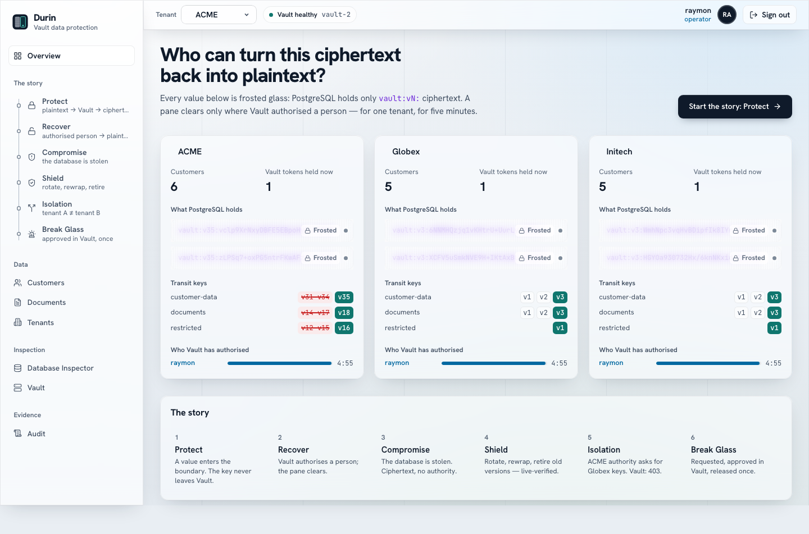

# Durin

**A Vault Enterprise data-protection reference application.**

> The database holds the data. Vault holds the key. Authority belongs to
> people, not to the application.

Durin stores customer data and documents the way a real application would,
in PostgreSQL. The database is deliberately visible, and every sensitive
value in it is Vault Transit ciphertext. Turning that ciphertext back into
plaintext takes authority that only Vault can issue, and Vault issues it to
a **verified person**, for **one tenant**, for **five minutes**. The
application itself holds none.

A live Web Console tells the story: data is protected, recovered by the right
person and refused to everyone else; the database is stolen and turns out to
be worthless; tenants cannot reach each other's keys; and emergency access
needs a second person's approval, in Vault, and works exactly once.



## What it demonstrates

| Scenario | What happens | Enforced by |
| --- | --- | --- |
| **Protect** | Plaintext → Vault Transit → `vault:vN:` ciphertext → PostgreSQL | Transit, per-tenant keys |
| **Recover** | An operator gets plaintext back; a viewer is signed in but not authorised | `auth/jwt` role `tenant-<t>`, 5-minute token named for the person |
| **Compromise** | A stolen database copy is ciphertext; decrypt attempts are denied | Vault policy |
| **Shield** | Rotate, rewrap inside Vault, retire old versions, re-issue authority; the stolen copy is now worthless to everyone | `min_decryption_version`, live-verified |
| **Isolation** | ACME's Vault token asks for Globex's key → 403 | per-tenant policies |
| **Break Glass** | RESTRICTED data: request → security admin approves in Vault → released once | Vault Control Groups |

Walkthrough and script: [docs/scenarios.md](docs/scenarios.md).

## Architecture in one picture

```text
Browser ──► Web Console (Nuxt + BFF) ──► API (Node) ──► vault-lb ──► Vault Enterprise (3-node Raft)
   cookie only        tokens stay here      │   logs in to Vault         Transit · auth/jwt · Control Groups
                                            │   as the signed-in person
                     Keycloak + LDAP ◄──────┘                    PostgreSQL: metadata + ciphertext only
```

- **Identity-derived authority:** the API presents the user's own Keycloak token
  to Vault (`auth/jwt`); Vault checks roles and tenants itself. The API's own
  Vault identity can read key metadata, nothing more.
- **No tokens in the browser:** the console's server keeps them; the browser
  holds an httpOnly session cookie.
- **Fail closed:** if Vault is unavailable, the answer is `503`, never plaintext.
- **Everything as code:** Podman Compose stacks, Terraform for Vault, secrets in
  Vault KV (never in `.env` or compose files).

Details: [docs/architecture.md](docs/architecture.md) ·
[docs/security-model.md](docs/security-model.md) ·
[docs/threat-model.md](docs/threat-model.md).

## Quick start

Requires Podman with a Compose provider, Terraform, the Vault CLI, Node.js 22
and a Vault Enterprise licence. The full first bring-up from a fresh clone is
in [docs/development.md](docs/development.md). Once bootstrapped:

```bash
make up                  # everything: Vault (+ vault-lb), PostgreSQL, migrations, API,
                         # identity (Keycloak + LDAP), Web Console → http://localhost:3000
make seed                # demo tenants, customers, documents

./scripts/identity-secrets.sh --show-user raymon   # a lab password
```

Sign in as **raymon** (operator, all tenants), **barend** (operator, ACME),
**viewer** (viewer, ACME + Globex) or **security-admin** (approves break
glass).

## Verify

```bash
make test-all        # every backend suite: identity, authority, RBAC, isolation, hardening, threat model, journeys
make test-frontend   # Playwright J0–J9 + accessibility against the live console
make reset           # back to baseline for the next demo (< 1 s)
```

Latest results: [docs/testing.md](docs/testing.md).

## Documentation

Everything is indexed in **[docs/index.md](docs/index.md)**: architecture,
security and threat model, Vault, Transit, database, multi-tenancy, identity,
break glass, the Web Console, the API contract, development, operations and
testing.

## Project layout

```text
backend/     API: the Data Trust Gateway (Node/Express)
ui/          Web Console: Nuxt 4 SPA + BFF, Playwright tests
compose/     Podman Compose stacks (vault, infra, backend, identity, ui, observability)
terraform/   Vault configuration (platform, transit, database)
scripts/     bootstrap, secrets, seed/reset, test suites
docs/        documentation (start at docs/index.md)
```

## License

[GPLv3](LICENSE)
